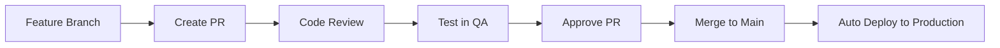

# Development Workflow

This document outlines the development practices, Git workflow, QA processes, and deployment procedures for the VibesApp project.

## Development Environment Setup

### Prerequisites

- **Node.js** (v16 or higher)
- **Git CLI** (latest version)
- **Visual Studio Code** (recommended)

### Required VS Code Extensions

- **ESLint** - Code quality and linting
- **Prettier** - Code formatting
- **GitHub Pull Requests** - PR management within VS Code
- **GitHub Codespaces** - Cloud development environment support

### Optional Tools

- **GitHub Desktop** - GUI for Git operations
- **Git Fork** - Advanced Git client for branch management

### Project Setup

```bash
# Clone the repository
git clone https://github.com/Dinoraptor101/vibesapp.git
cd vibesapp

# Install dependencies
npm install

# Copy environment variables
cp .env.example .env.local

# Start development server
npm start
```

### Environment Variables

```bash
# .env.local
REACT_APP_API_URL=http://localhost:5001
REACT_APP_API_KEY=your-development-api-key
REACT_APP_SOCKET_URL=http://localhost:5001
REACT_APP_POSTHOG_KEY=your-posthog-key
```

## Git Workflow

### Branch Naming Convention

Format: `{first_initial}{lastname}/{feature-description}`

**Examples:**

- `jsmith/creating-comment-section`
- `adoe/fixing-login-bug`
- `mwilson/implementing-dark-theme`

### Branching Strategy

```bash
# Create new feature branch
git checkout main
git pull origin main
git checkout -b jsmith/new-feature

# Work on feature
# ... make changes ...

# Commit changes
git add .
git commit -m "feat: implement new feature functionality"

# Push to remote
git push origin jsmith/new-feature
```

### Commit Message Guidelines

Follow conventional commit format:

```
<type>(<scope>): <description>

[optional body]

[optional footer]
```

**Types:**

- `feat:` - New feature
- `fix:` - Bug fix
- `docs:` - Documentation changes
- `style:` - Code style changes (formatting, etc.)
- `refactor:` - Code refactoring
- `test:` - Adding or updating tests
- `chore:` - Maintenance tasks

**Examples:**

```bash
feat(auth): add user registration flow
fix(posts): resolve image upload timeout issue
docs(api): update authentication documentation
style(components): apply consistent button styling
refactor(utils): extract common validation logic
test(hooks): add unit tests for useLocation hook
chore(deps): update React to version 18.2
```

## Code Quality Standards

### Casing Conventions

- **train-case** - Branch names, file names, CSS classes
- **camelCase** - Variable names, function names
- **PascalCase** - Component names, class names, TypeScript interfaces

### ESLint Configuration

```json
{
  "extends": ["react-app", "react-app/jest", "@typescript-eslint/recommended"],
  "rules": {
    "no-unused-vars": "warn",
    "no-console": "warn",
    "@typescript-eslint/no-explicit-any": "warn",
    "react-hooks/exhaustive-deps": "warn"
  }
}
```

### Prettier Configuration

```json
{
  "semi": true,
  "trailingComma": "es5",
  "singleQuote": true,
  "printWidth": 80,
  "tabWidth": 2,
  "useTabs": false
}
```

### Code Review Checklist

- [ ] Code follows established patterns and conventions
- [ ] TypeScript types are properly defined
- [ ] Components are accessible (ARIA labels, keyboard navigation)
- [ ] Error handling is implemented
- [ ] Performance considerations addressed
- [ ] Tests are included for new functionality
- [ ] Documentation is updated if needed

## Pull Request Process

### Creating Pull Requests

1. **Complete your feature** on the feature branch
2. **Test thoroughly** in local development
3. **Update documentation** if applicable
4. **Create PR** with descriptive title and details

### PR Template

```markdown
## Description

Brief description of the changes made.

## Type of Change

- [ ] Bug fix
- [ ] New feature
- [ ] Breaking change
- [ ] Documentation update

## Testing

- [ ] Unit tests pass
- [ ] Integration tests pass
- [ ] Manual testing completed
- [ ] Tested in QA environment

## Screenshots (if applicable)

[Add screenshots of UI changes]

## Checklist

- [ ] Code follows style guidelines
- [ ] Self-review completed
- [ ] Comments added for complex code
- [ ] No new warnings or errors
- [ ] Documentation updated
```

### Review Requirements

- **All PRs** require at least one reviewer approval
- **Hotfixes** are exempt from review requirement (emergency only)
- **Reviewers** should test functionality locally when possible
- **Authors** are responsible for merging their approved PRs

### Review Guidelines

**For Reviewers:**

- Test the functionality locally
- Check for code quality and consistency
- Verify error handling and edge cases
- Ensure accessibility considerations
- Validate TypeScript types and interfaces

**For Authors:**

- Respond to feedback promptly
- Address all review comments
- Update PR when changes are made
- Ensure CI/CD checks pass before requesting re-review

## Quality Engineering (QA)

### QA Environment

- **URL**: [qa.vibesapp.net](https://qa.vibesapp.net)
- **Purpose**: Testing multiple PRs together for stability and performance
- **Database**: MongoDB Atlas (test environment)
- **Images**: AWS S3 (shared with production)

### QA Process

1. **Merge to QA branch** - No PR required for QA deployment
2. **Test all features** - Verify existing functionality still works
3. **Performance testing** - Check load times and responsiveness
4. **Cross-browser testing** - Ensure compatibility
5. **Mobile testing** - Test on various devices and screen sizes

### QA Deployment Options

#### Option 1: Merge to QA Branch

```bash
# Switch to QA branch
git checkout qa
git pull origin qa

# Merge your feature branch
git merge jsmith/new-feature
git push origin qa
```

#### Option 2: Heroku Deploy Button

- Use Heroku's deploy feature for isolated testing
- Deploy specific branch without affecting QA branch
- Useful for testing individual features

### QA Reset Policy

- **QA branch hard-resets** with main branch manually
- **Always keep QA in working state** - broken features should be reverted
- **Coordinate with team** before major changes to QA

### Testing Scenarios

**Core User Flows:**

- [ ] User registration and login
- [ ] Creating posts with images
- [ ] Liking and disliking posts
- [ ] Group chat functionality
- [ ] Direct messaging (if vibes sufficient)
- [ ] Profile viewing and editing
- [ ] Theme switching
- [ ] Mobile responsiveness

**Edge Cases:**

- [ ] Offline functionality
- [ ] Poor network conditions
- [ ] Location permission denied
- [ ] Large image uploads
- [ ] Long text content
- [ ] Multiple concurrent users

## Deployment Process

### Standard Deployment Flow



### Environment Details

#### Production

- **Frontend**: [vibesapp.net](https://vibesapp.net)
- **Backend**: [api.vibesapp.net](https://api.vibesapp.net)
- **Hosting**: GitHub Pages (frontend), Heroku (backend)
- **Database**: MongoDB Atlas (production)
- **CDN**: AWS CloudFront
- **Deployment**: GitHub Actions on main branch merge

#### QA/Staging

- **Frontend**: [qa.vibesapp.net](https://qa.vibesapp.net)
- **Backend**: [api-qa.vibesapp.net](https://api-qa.vibesapp.net)
- **Hosting**: Heroku (both frontend and backend)
- **Database**: MongoDB Atlas (test)
- **Deployment**: Automatic on QA branch push

### Deployment Triggers

#### Automatic Production Deploy

```yaml
# .github/workflows/deploy.yml
name: Deploy to Production
on:
  pull_request:
    types: [closed]
    branches: [main]

jobs:
  deploy:
    if: github.event.pull_request.merged == true
    runs-on: ubuntu-latest
    steps:
      - uses: actions/checkout@v2
      - name: Setup Node.js
        uses: actions/setup-node@v2
        with:
          node-version: '16'
      - name: Install dependencies
        run: npm ci
      - name: Build
        run: npm run build
      - name: Deploy
        run: npm run deploy
```

#### QA Deploy

- **Trigger**: Push to `qa` branch
- **Method**: Heroku Git integration
- **Automatic**: Yes, no manual intervention needed

### Hotfix Process

For emergency production fixes:

```bash
# Create hotfix branch from main
git checkout main
git pull origin main
git checkout -b hotfix/critical-bug-fix

# Make minimal necessary changes
# ... fix the issue ...

# Test locally
npm test
npm run build

# Commit and push
git add .
git commit -m "hotfix: resolve critical production issue"
git push origin hotfix/critical-bug-fix

# Create PR and merge immediately (no review required for emergency)
# Deploy automatically triggers
```

**Hotfix Guidelines:**

- **Emergency repairs only** - not for new features
- **Minimal changes** - fix the specific issue only
- **No review required** - but inform team immediately
- **Document thoroughly** - explain what was fixed and why
- **Follow up** - schedule proper fix if hotfix is temporary

## Monitoring & Rollback

### Production Monitoring

- **Health checks** - Automated endpoint monitoring
- **Error tracking** - Console errors and API failures
- **Performance metrics** - Page load times, API response times
- **User analytics** - PostHog integration for usage patterns

### Rollback Procedures

```bash
# If deployment causes issues, rollback via GitHub
# 1. Go to Actions tab in GitHub
# 2. Find the successful deployment before the problematic one
# 3. Re-run that deployment

# Alternative: Revert the merge commit
git revert -m 1 <merge-commit-hash>
git push origin main
```

### Post-Deployment Checklist

- [ ] Site loads correctly
- [ ] Core user flows work
- [ ] No console errors
- [ ] API endpoints respond correctly
- [ ] Real-time features functional
- [ ] Mobile experience intact

## Development Best Practices

### Code Organization

- **Single responsibility** - Components and functions do one thing well
- **Consistent naming** - Follow established conventions
- **Type safety** - Use TypeScript effectively
- **Error boundaries** - Handle errors gracefully
- **Performance** - Consider lazy loading and memoization

### Security Practices

- **Environment variables** - Never commit secrets
- **API keys** - Use environment-specific keys
- **Input validation** - Validate all user inputs
- **HTTPS only** - All API calls use HTTPS
- **Content Security Policy** - Implement CSP headers

### Documentation Standards

- **Code comments** - Explain complex logic
- **README updates** - Keep documentation current
- **API documentation** - Document interface changes
- **Architecture decisions** - Record significant choices

### Collaboration Guidelines

- **Communication** - Use GitHub issues and discussions
- **Code sharing** - Review each other's work
- **Knowledge sharing** - Document learnings and patterns
- **Help availability** - Contact via Telegram: [https://t.me/Dnegai](https://t.me/Dnegai)

## Troubleshooting

### Common Issues

#### Build Failures

```bash
# Clear cache and reinstall
rm -rf node_modules package-lock.json
npm install

# Check for TypeScript errors
npm run type-check

# Check for linting errors
npm run lint
```

#### Development Server Issues

```bash
# Kill processes on port 3000
lsof -ti:3000 | xargs kill -9

# Restart development server
npm start
```

#### Git Issues

```bash
# Reset to last known good state
git reset --hard HEAD~1

# Force sync with remote
git fetch origin
git reset --hard origin/main
```

### Getting Help

- **ChatGPT/AI assistants** - For general programming questions
- **GitHub Issues** - For project-specific problems
- **Team communication** - Telegram contact provided
- **Documentation** - Check existing docs first

**Security Note:** Never share environment variables, API keys, or other secrets when asking for help. Report any accidental exposure immediately.
